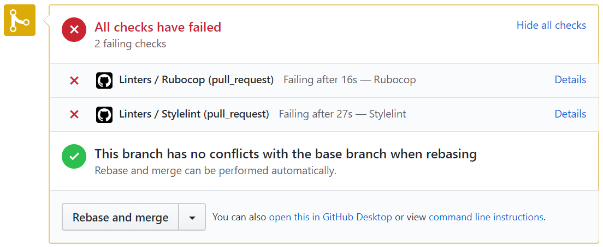
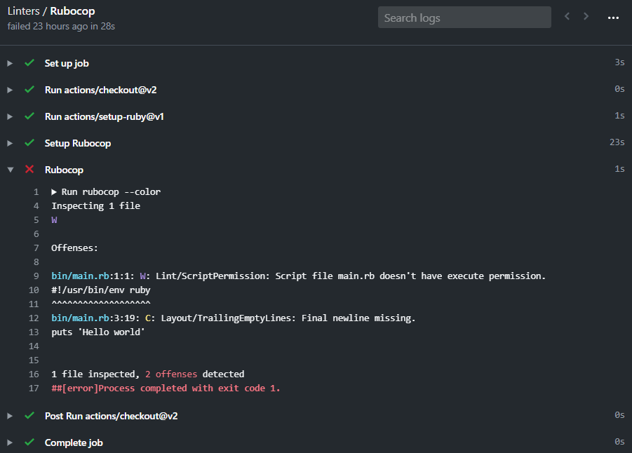

# Ruby on Rails Course

If you are not familiar with linters and GitHub Actions, read [root level README](../README.md).

## Set-up GitHub Actions

This GitHub Action is going to run [Rubocop](https://docs.rubocop.org/en/stable/) and [Stylelint](https://stylelint.io/) to help you find style issues.

[Stylelint](https://stylelint.io/) is a linter for your stylesheets that helps you avoid errors and enforce conventions.

[Rubocop](https://docs.rubocop.org/en/stable/) is a Ruby static code analyzer (a.k.a. linter) and code formatter. It will enforce many of the guidelines outlined in the community [Ruby Style Guide](https://rubystyle.guide/).

Please do the following **steps in this order**:

1. In the first commit of your feature branch create a `.github/workflows` folder and add a copy of [`.github/workflows/linters.yml`](.github/workflows/linters.yml) to that folder.
    - **Remember** to use the file linked above
    - **Remember** that `.github` folder starts with a dot.
2. **Do not make any changes in config files - they represent style guidelines that you share with your team.**
    - If you think that change is necessary - open a [Pull Request in this repository](../README.md#contributing) and let your code reviewer know about it.
3. When you open your first pull request you should see the result of the GitHub Actions:



Click on the `Details` link to see the full output and the errors that need to be fixed:



## Set-up linters in your local env

**Note**: The `npm` package manager is going to create a `node_modules` directory to install all of your dependencies. You shouldn't commit that directory. To avoid that, you can create a [`.gitignore`](https://git-scm.com/docs/gitignore) file and add `node_modules` to it:

```
# .gitignore
node_modules/
```

### Rubocop

1. Add this line to the `Gemfile`
    ```
    gem 'rubocop', '>= 1.0', '< 2.0'
    ```
    *not sure how to use Gemfile? Read [this](https://bundler.io/v1.15/guides/bundler_setup.html)*.
2. Run `bundle install`.
3. Copy [.rubocop.yml](./.rubocop.yml) to the root directory of your project
4. **Do not make any changes in config files - they represent style guidelines that you share with your team.**
    - If you think that change is necessary - open a [Pull Request in this repository](../README.md#contributing) and let your code reviewer know about it.
5. Run `rubocop`.
6. Fix linter errors.
7. **IMPORTANT NOTE**: feel free to research [auto-correct options for Rubocop](https://rubocop.readthedocs.io/en/latest/auto_correct/) if you get a flood of errors but keep in mind that correcting style errors manually will help you to make a habit of writing a clean code!

### Stylelint

1. Run

   ```
   npm install --save-dev stylelint@13.x stylelint-scss@3.x stylelint-config-standard@21.x stylelint-csstree-validator@1.x
   ```

   *not sure how to use npm? Read [this](https://docs.npmjs.com/downloading-and-installing-node-js-and-npm).*

2. Copy [.stylelintrc.json](./.stylelintrc.json) to the root directory of your project.
3. **Do not make any changes in config files - they represent style guidelines that you share with your tem.**
   - If you think that change is necessary - open a [Pull Request in this repository](../README.md#contributing) and let your code reviewer know about it.
4. Run `npx stylelint "**/*.{css,scss}"` on the root of your directory of your project.
5. Fix linter errors.
6. **IMPORTANT NOTE**: feel free to research [auto-correct options for Stylelint](https://stylelint.io/user-guide/usage/options) if you get a flood of errors but keep in mind that correcting style errors manually will help you to make a habit of writing a clean code!

## RSpec/Heroku Actions

Feel free to add your own deployment actions which can run your tests and deploy to Heroku.

Make sure that you do not modify the [`.github/workflows/linters.yml`](.github/workflows/linters.yml) but that you create a separe GitHub Action workflow file for that.

- [GitHub Actions with Ruby on Rails: Setting up Continuous Integration](https://gorails.com/episodes/github-actions-continuous-integration-ruby-on-rails)
- [Deploying to Heroku from GitHub Actions](https://dev.to/heroku/deploying-to-heroku-from-github-actions-29ej)
- [Building a Rails CI pipeline with GitHub Actions](https://boringrails.com/articles/building-a-rails-ci-pipeline-with-github-actions/)
- [Github Actions to run Rubocop and RSpec tests on Rails with Postgres](https://dev.to/abdellani/github-actions-to-run-rubocop-and-rspec-tests-on-rails-with-postgres-47i)

## Troubleshooting

- If you are building an API only Rails application
For API only Rails application you can remove the Stylelint config. To do so remove line no. [23](https://github.com/TheDevMBA/linters-config/blob/52c369fd4839e6b54116ad7a055603047469dede/ror/.github/workflows/linters.yml#L23) to [36](https://github.com/TheDevMBA/linters-config/blob/52c369fd4839e6b54116ad7a055603047469dede/ror/.github/workflows/linters.yml#L36) from the [linter.yml]((https://github.com/TheDevMBA/linters-config/blob/main/ror/.github/workflows/linters.yml)) file.